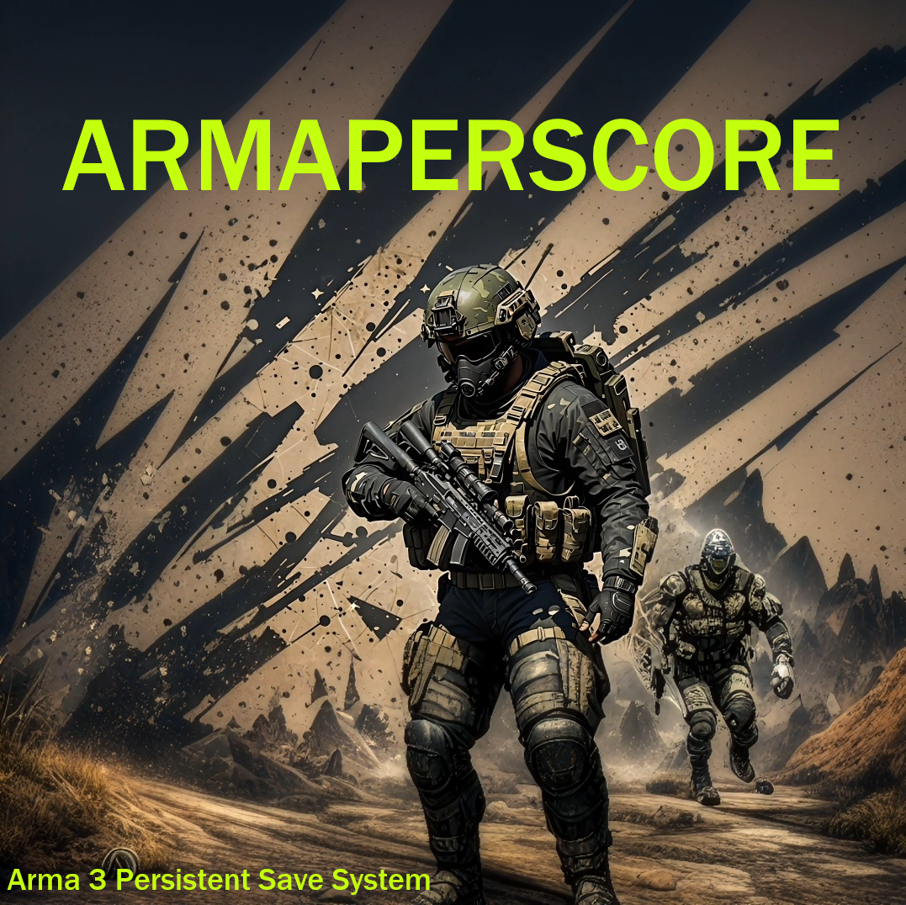

# ARMAPERSCORE - Arma Persistent Core System

## Description
Arma Persistent Core System is a script that enables ARMA 3 mission maker to easily implement a save system for their mission (if you do not prefer vanilla save system) as vanilla save system will cause a lot of issues for large scale mission. Imagine Antistasi. This script is heavily modified from original [Persistent Save System by Sukhoi191](https://gitlab.com/sukhoi191_a3/arma-3-persistent-save-system). The original script is currently no longer maintained (as far as I know of) and had a lot of bugs. This modified/revisited version features flexibiliy, optimized, and a simple custom GUI intended for saving and loading. 

## Features 
* Persist vehicle position, rotation, crew, turret and etc.
* Persist player units alongside team member.
* Persist environment information like overcast, date and time.
* Persist all map markers including player placed markers. 

## Installation
* Download the latest release from the [releases](https://github.com/NikolaiF90/ArmaPersistentCoreSystem/releases) page.
* Extract ARMAPERSCORE from the zip file to your mission folder.

## Usage
* Open 3DEN Mission Editor.
* If you already have a description.ext and init.sqf, copy everything and paste it to your existing own file.
* Open mission folder >> Persistent >> Functions >> fn_configurePersistent.sqf to configure the script according to your preference. But for now the variable Persistent_SaveIntervals does nothing. 
* From here you are pretty much done. You don't need to edit anything else. 
* Start the mission and use mouse scroll wheel to reveal the save action. 

## Contributing
* Fork the repository.
* Create a branch for your changes.
* Create a pull request. 

## License 

With this license you are free to adapt (i.e. modify, rework or update) and share (i.e. copy, distribute or transmit) the material under the following conditions:   
* Attribution - You must attribute the material in the manner specified by the author or licensor (but not in any way that suggests that they endorse you or your use of the material).
* Noncommercial - You may not use this material for any commercial purposes.
* Arma Only - You may not convert or adapt this material to be used in other games than Arma.
* Share Alike - If you adapt, or build upon this material, you may distribute the resulting material only under the same license.

## Credits
* [NikolaiF90 (PrinceF90)](https://github.com/NikolaiF90)
* [Sukhoi191](https://gitlab.com/sukhoi191)
